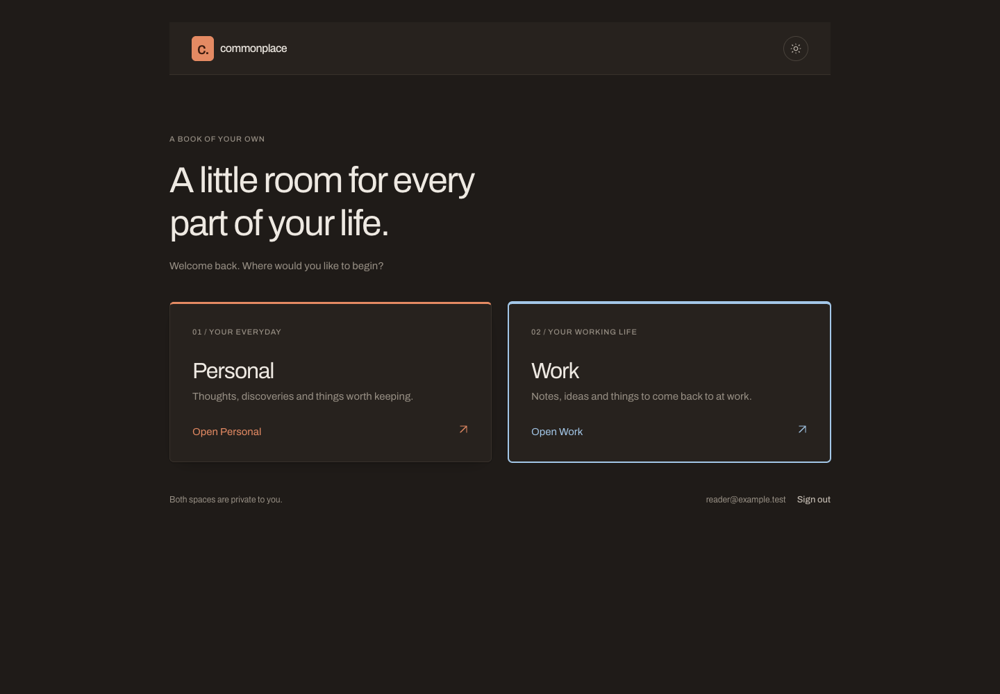
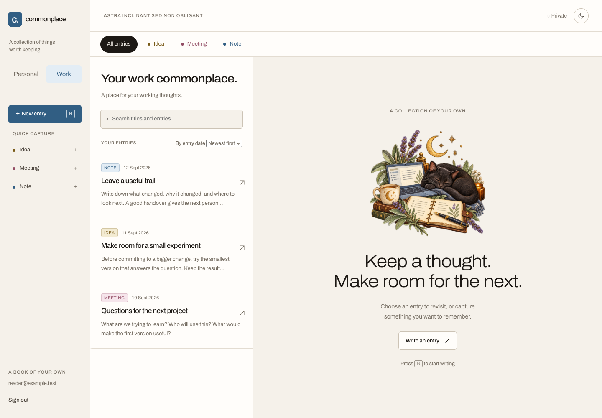

# Commonplace

A private commonplace book for notes, ideas and things worth keeping. Personal and Work spaces keep your collections separate, with both private to your account.

The React web app uses Supabase for email/password sign-in, PostgreSQL storage and private image attachments. Saved entries are available across devices.

Home screen installation is supported; see the [installation instructions](docs/hosted-setup.md#5-install-on-your-phone). An internet connection is required.

## Your spaces

Choose Personal or Work after signing in, then switch between them from the sidebar.



The Work space has its own entries, search and entry types.



Both screenshots use sample content and a fictional account.

## What you can do

- Write and edit Markdown entries, with a preview before saving.
- Organise entries with custom types, tags, a source, a URL and image attachments.
- Set an original entry date and browse newest or oldest first.
- Search titles and entry text, filter by type, and capture new entries from type shortcuts.
- Link entries by typing `[[` and choosing one; a link to a title that does not exist yet becomes a new entry with one press, and each entry lists what links to it.
- Move entries between Personal and Work, delete entries you no longer want, and switch between light and dark themes.

Saves check the entry revision so an older edit cannot silently overwrite a newer one. Retry receipts let interrupted saves be retried without creating duplicate entries.

## Run locally

Follow the [hosted setup guide](docs/hosted-setup.md) to prepare Supabase and configure `frontend/.env.local`. Install Bun 1.4.2 and Node 24, then:

```sh
bun install --cwd frontend --frozen-lockfile
bun run --cwd frontend dev
```

Open `http://localhost:5173`. The interface runs locally during development; saved entries live in the configured cloud database.

Apply all SQL migrations in `supabase/migrations/` in filename order when setting up a fresh database. Disable public signups and provision your own account, as described in the setup guide.

## Component catalogue

Storybook shows the editor, entry context, images and theme toggle with sample data:

```sh
bun run --cwd frontend storybook
```

Open `http://localhost:6006`. To build a static catalogue, run `bun run --cwd frontend build:storybook`.

## Verify

```sh
bun run --cwd frontend test
bun run --cwd frontend build
bun run --cwd frontend test:browser
bun run --cwd frontend check:connection
bun run --cwd frontend export
```

Use `bun run --cwd frontend test`, including `run`, to invoke Vitest; `bun test` invokes Bun's separate test runner.

Browser tests use installed Google Chrome and simulated API responses. Database tests execute the migrations in embedded PostgreSQL. The connection check probes the configured Supabase project's registration and anonymous-access restrictions; it does not sign in or save entries. The export signs in as you and writes every entry and image to `export/`; see the [setup guide](docs/hosted-setup.md#6-export-your-book). These checks do not replace the live two-session walkthrough in the setup guide.

## Current limits

Drafts stay in memory and can be lost when the app closes. Offline capture, general file attachments, import and agent access are not implemented. Export is a local script; restoring an export into a fresh project is not yet implemented.

The [hosted architecture](docs/plans/2026-09-11-hosted-commonplace-design.md) records the design direction. Earlier filesystem-first plans remain in `docs/plans/` as historical context.
