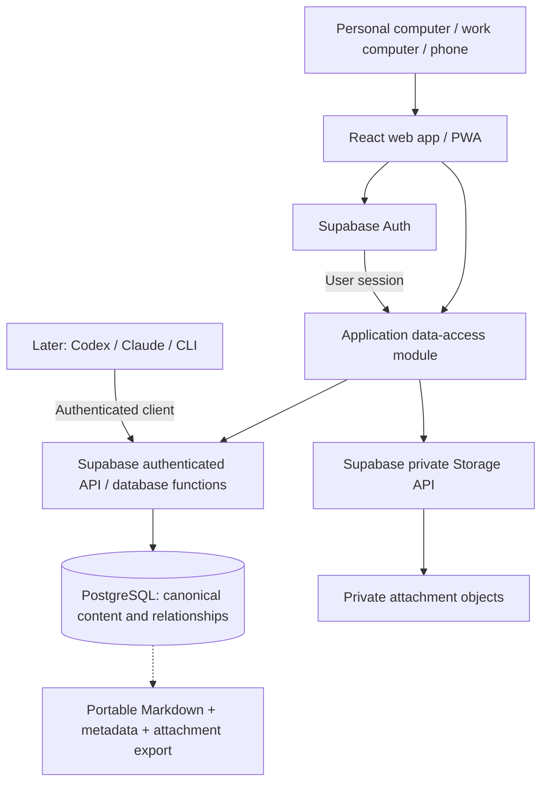

# Hosted Commonplace: architecture review and migration proposal

Date: 2026-09-11
Status: approved for implementation on 2026-09-11. The architecture review below records the starting point; see [implementation progress](hosted-progress.md) for the current state.

## Overview

Commonplace is to become a private, online-first knowledge system shared by a personal computer, work computer and phone. The user has confirmed a fresh infrastructure setup. The hosted web app is the primary interface, with a PWA for mobile. PostgreSQL becomes the canonical source of entry content, metadata and relationships; private object storage holds attachment bytes.

Recommend Vite + React + TypeScript, TanStack Query, and a small application data-access module backed initially by Supabase's authenticated API, PostgreSQL and Storage. Keep Markdown as the entry body format and a portable export format. Supabase is the recommended provider, not a deployed or purchased service. No application code, infrastructure, or personal content was changed for this review.

This replaces the original design's file authority, filename identity, Git synchronization, local index reconciliation and network-only authentication. The existing implementation is early enough that this is primarily a change of foundation, rather than a migration of a mature deployed product.

## 1. Current implementation

Reviewed the working tree, including uncommitted implementation, rather than only the single existing specification commit. There is no frontend, HTTP server, authentication, MCP server, attachment upload implementation or test suite in the current tree. Dependencies are installed and the Python package is scaffolded. The previous runtime probe verified FTS5 and sqlite-vec loading; the last lint run still had failures. End-to-end capture and real semantic retrieval have not been verified. Phase 1 is incomplete.

| Area | What the code currently does | Consequence for the new direction |
|---|---|---|
| [CLI](../../src/commonplace/cli/app.py) | Typer commands call the Python service in-process; opens the local editor | Becomes an optional authenticated client/import tool later |
| [Service](../../src/commonplace/core/service.py) | Constructs `Vault`, lazily constructs `Index`, uses `FileLock`, reconciles before index-backed reads | Has a useful operation vocabulary but is coupled to local persistence |
| [Vault](../../src/commonplace/core/vault.py) | Parses YAML/Markdown, allocates filename stems, uses temp-file replacement, checks hashes | Parsing/export ideas can survive; file writes cease to be primary persistence |
| [Models](../../src/commonplace/core/models.py) | Entries contain `slug`, `path`, `content_hash`; creation date, tags, source string and metadata | Needs UUIDs, ownership, update date, revision, sources and attachments; type validation must stop enforcing directory rules |
| [Index](../../src/commonplace/core/index.py) | SQLite entries, tags, links, FTS5, chunks, vectors and problems; rebuild removes derived entry rows | This rebuild contract is unsafe for a canonical database and must not transfer to PostgreSQL |
| [Search](../../src/commonplace/core/search.py) | Direct SQLite queries and cosine distances, followed by reciprocal rank fusion | Ranking concepts are reusable, SQL and execution location change |
| [Embeddings](../../src/commonplace/core/embeddings.py) | An `Embedder` protocol and a local FastEmbed implementation with model cache | Optional future batch worker; should not be required on client devices |
| [Configuration](../../src/commonplace/core/config.py), [watcher](../../src/commonplace/core/watcher.py) | Device paths, XDG storage, per-vault locks, continuous file reconciliation | Keep only for local tooling, remove from hosted request handling |

The SQLite `document` column contains serialized entry JSON, but there is no implemented local JSON-file database. The file vault is the intended authority. PostgreSQL cannot replace `sqlite3.connect()` alone: authority, identity, authentication and save semantics all change.

## 2. Recommended architecture



**UI:** Owns presentation, navigation, editor drafts, accessibility and PWA behaviour. It calls application operations such as `createEntry`, `updateEntry`, `listEntries` and `searchEntries`. It does not construct database queries or know table names, object keys, filesystem paths or Supabase response envelopes.

**Data-access module:** Owns request mapping, domain-shaped results, cursor pagination, retry rules and errors. Supabase SDK imports are confined to its implementation and the auth/storage modules. Start with one concrete implementation. Do not create a universal repository framework or maintain feature parity with a second local database. A later Python API or different PostgreSQL provider can replace this implementation without rewriting screens, although provider authentication, policies and storage still require deliberate migration.

**Server:** Supabase's API and a small set of PostgreSQL functions provide the first application's server interface. Compound writes happen in database transactions. There is no need for a separate FastAPI deployment for initial CRUD. A Python process remains an option for paper imports, embedding jobs or future server behaviour that benefits from it; it must access the shared store through an authenticated, controlled interface.

**Deployment:** Build the React app as static assets on Vercel or Cloudflare Pages, with Supabase providing the separately hosted data/auth/storage layer. Neither frontend deployment requires a live local vault. The providers document Vite deployment; configure SPA route fallback and exact authentication callback URLs for the chosen host. [Vercel Vite guide](https://vercel.com/docs/frameworks/frontend/vite), [Cloudflare Pages Vite guide](https://developers.cloudflare.com/pages/framework-guides/deploy-a-vite3-project/)

Suggested new code locations, created only when implementation resumes:

```text
frontend/src/domain/entries.ts       Application types and validation
frontend/src/data/knowledge.ts       Entry/search/relationship operations
frontend/src/data/supabase.ts        Provider client configuration
frontend/src/data/auth.ts            Session and sign-in operations
frontend/src/data/attachments.ts     Upload and private download operations
frontend/src/features/               Screens and editor behaviour
supabase/migrations/                Versioned schema, constraints, grants, policies
supabase/tests/                     Database and authorization checks
```

## 3. Data model and identity

| Record | Initial shape |
|---|---|
| `entries` | UUID `id`, UUID `owner_id`, `title`, `body_markdown`, open-string `kind`, JSONB `metadata`, `created_at`, `updated_at`, integer `version`, nullable `deleted_at` |
| `tags` | UUID `id`, `owner_id`, display `name`, normalized name unique per owner |
| `entry_tags` | `owner_id`, `entry_id`, `tag_id`; unique membership |
| `entry_links` | `owner_id`, `source_entry_id`, nullable `target_entry_id`, nullable `unresolved_target`, optional heading/label information |
| `sources` | UUID `id`, `owner_id`, source kind, label/title, optional URL/external identifier, JSONB bibliographic metadata |
| `entry_sources` | `owner_id`, `entry_id`, `source_id`, optional locator such as page/chapter |
| `attachments` | UUID `id`, `owner_id`, `entry_id`, opaque storage key, original filename, media type, byte size, checksum, upload state, creation date |

Build entries first, then add the related records as their features are implemented. Use relational columns for identity, ownership and queried relationships; use JSONB for evolving type-specific metadata. Avoid storing the entire authoritative entry as an opaque JSON blob. `kind` remains an open string, independent of folders or a fixed database enum.

Stable UUIDs identify entries in routes, links and API calls. Titles and optional display slugs can change. A proposed in-body representation is `[[UUID|label]]` for resolved links, with unresolved text kept as a ghost until resolved. Define the exact Markdown syntax before shipping links. Parse outside code blocks and keep explicit link rows in agreement with the saved body in the same mutation. Markdown export can translate UUID links into relative filenames.

Use database-enforced foreign keys and uniqueness, including owner-aware relationships: a link, tag membership, citation or attachment cannot connect records owned by different users. An unresolved link has an unresolved target; a resolved link has a target ID. Duplicate links have a defined uniqueness rule. Omitted metadata keys are preserved on patch; intentional removal is explicit.

Creation/update timestamps are timezone-aware. The server sets ordinary timestamps and increments `version` for every content or relationship change; clients cannot set `updated_at` or ownership. An import operation may preserve a historical creation date. `deleted_at` enables undo and provides a foundation for eventual deletion propagation; it is not a complete future sync protocol.

## 4. Save contracts, security and failure behaviour

### Application contracts

- `createEntry(input, requestId)` returns the saved entry with ID, server timestamps and version. Allocate a stable UUID for the attempt and reuse it after an uncertain network result; check a request identity/payload fingerprint so retries do not create duplicates or silently replace data.
- `updateEntry(id, patch, expectedVersion, requestId)` checks ownership and version atomically. Entry, tags, link rows and citations commit together. A stale revision returns a distinct conflict; keep the user's draft and let them review the latest version. Do not silently apply last-write-wins.
- `deleteEntry(id, expectedVersion)` records a tombstone and increments version. Search/list operations exclude deleted entries by default.
- `listEntries(filters, cursor)` and `searchEntries(query, filters, cursor)` return domain records with bounded results and a stable cursor. They never reconcile local files.
- Attachment operations reserve an attachment ID, upload bytes, then finalize the record. Upload and PostgreSQL writes are not one transaction: pending/failed states and retry/cleanup are explicit.
- Errors distinguish unauthenticated, inaccessible/not found, invalid input, revision conflict and transient/unavailable. UI notices are useful without exposing raw SQL or credentials.

### Private access

Start with one provisioned personal account and disable public registration. Keep owner IDs and authorization from the first migration, without building team sharing or roles. Every exposed operation must enforce user ownership; browser login is not a substitute for database policies. Supabase RLS and SQL grants work together to limit row access. [Row Level Security](https://supabase.com/docs/guides/database/postgres/row-level-security)

Recommended SQL layout: canonical tables in an unexposed `app` schema, a small set of callable functions in the exposed `api` schema. Functions use `SECURITY INVOKER`, explicit schema names and narrowly granted execute permissions. Grant the authenticated role only the underlying privileges the functions need, enable owner RLS on the tables, and do not expose arbitrary SQL execution or the `app` schema over the Data API. This permits transactions without handing the browser alternative table-write routes that bypass the application's version check. Verify grants, schema exposure and attempted bypasses in integration tests. [Custom API schemas](https://supabase.com/docs/guides/api/using-custom-schemas), [Database functions and privileges](https://supabase.com/docs/guides/database/functions)

The browser receives the project's publishable key and a user session; secret/service-role credentials stay out of browser bundles and ordinary CLI/MCP clients. Such privileged keys bypass RLS. [Supabase API keys](https://supabase.com/docs/guides/getting-started/api-keys)

Attachments use private buckets with owner/entry access policies. Persist attachment IDs and storage keys; resolve short-lived signed URLs or authorized downloads when displaying them. Never save expiring URLs as permanent Markdown content. [Private Storage access](https://supabase.com/docs/guides/storage/buckets/fundamentals)

Sanitize rendered Markdown/links, restrict upload sizes/types, clear in-memory query caches on logout or user change, and avoid caching personal API responses in a service worker initially. This is authenticated hosted privacy; end-to-end encryption is not part of this proposal. The hosting providers process stored content and authenticated work-device access remains subject to that device's management.

### Save/search/recovery failures

A cloud save is confirmed only when the database operation succeeds. Keep the current editor draft on network or session failure; an installable PWA does not imply offline writes. Start without persistent draft storage on shared/work devices, then add opt-in draft recovery with logout cleanup if needed.

Use PostgreSQL full-text search first. Its ranking differs from SQLite BM25, so do not promise identical ordering. Start with a documented multilingual tokenization approach and English/Portuguese fixtures. Add pgvector and asynchronous embeddings after the hosted capture loop works; a save must not wait for inference. Version embeddings by model and source revision so a stale job cannot overwrite current vectors. [PostgreSQL full-text search in Supabase](https://supabase.com/docs/guides/database/full-text-search), [Supabase vector search](https://supabase.com/docs/guides/ai/semantic-search)

Keep application code and schema migrations in Git. Export content with stable IDs, metadata, sources and assets; verify re-import into a fresh database. Database backups do not contain Storage object bytes, so attachment backup/export is a separate requirement. Check retention and restore options when selecting the hosting plan. [Supabase backup scope](https://supabase.com/docs/guides/platform/backups)

## 5. Changes to make now and work to defer

**Make before building the new UI:** Change the specification's authority and identity rules; introduce ownership, server timestamps, revisions and retry identity; define atomic save contracts; put provider calls behind the application data module; version database migrations and access policies; define private attachment references and portable exports. Stop expanding local path configuration, file locks and SQLite reconciliation as product infrastructure.

**Keep simple/local:** Development tools, tests, synthetic fixtures, Markdown parsing/export and optional batch import scripts. Preserve useful validation/link/ranking ideas from Python, with behaviour tests before reuse; they are draft code, not a verified library. Use one hosted database and one frontend. Refetch on focus/reconnect and invalidate queries after saves before adding Realtime. Treat query caches as disposable. Retain Markdown editing, generic custom entry types and the planned warm visual style.

**Defer:** Native apps, offline databases, conflict-free replicated data types, automatic merge, bidirectional file synchronization, collaboration roles, a universal storage adapter framework, graph polish, sophisticated digest scheduling and mandatory semantic indexing. Local FastEmbed may remain an optional worker experiment; the phone and work computer must not require it. Supabase's provider coupling is contained rather than eliminated: PostgreSQL data is portable, while auth identities, RLS helpers, storage and API exposure require migration work.

## 6. Small, safe migration steps

| Step | Deliverable | Completion / rollback check |
|---|---|---|
| 0. Rebaseline | Mark the old local-first plan paused; agree this proposal and preserve the unfinished code as a reference | No data or implementation changes; clearly identify the active plan |
| 1. Prove the data foundation | Local Supabase/PostgreSQL migrations for entries, user ownership, version checks and authenticated RPC; synthetic fixtures | Fresh migrations run; anonymous and second-user access denied; two edits from one revision cannot both succeed; duplicate retries are safe |
| 2. Build a thin hosted slice | Auth, capture, list and edit through `knowledge.ts`; development Supabase and a preview frontend deployment | Save on one computer and read on another after refetch; no file paths or local Python process involved; anonymous API requests remain denied |
| 3. Add knowledge structure | Tags, links/ghosts, sources, created/updated display and PostgreSQL text search | Transaction rollback leaves no partial relationships; title changes retain links; cross-owner references fail |
| 4. Add private attachments and exports | Photo/file capture, reliable upload states, private rendering, content/asset export | Interrupted upload can retry; unauthorized download denied; export restores entries and actual attachment bytes |
| 5. Import only real existing content | Read-only dry-run inventory; original stem/path to UUID manifest; idempotent importer preserving dates and metadata | Compare counts/content/checksums and links in staging; keep originals; skip import if there is no real vault to migrate |
| 6. Establish daily use | Production hosting, PWA installation, authentication recovery, backup/restore rehearsal | Personal computer, work computer and phone use the same database; failed saves preserve drafts; logout clears cached content |
| 7. Reconnect agents and enrich retrieval | Authenticated CLI/MCP for Codex and Claude, then optional pgvector, related entries and shared digest | Both agents exercise the same save/version rules; neither writes a separate authoritative local archive |

Avoid dual writing during migration. If a real vault has been actively used, pause its writers for a final delta import, validate the hosted copy, then make the original read-only as an archive. Git pulls and local watchers must not continue changing a competing source of truth. Do not perform the previously planned arxiv symlink switch; adapt that writer to the authenticated import/write interface when its actual behaviour is inspected.

Each schema change should be additive until verified, with a restore path. Before real-data cutover, keep both a content export and a database/object backup; after new cloud writes exist, reverting to the old vault requires an explicit export, not merely switching the UI back.

## Review lenses and remaining choices

- **Scope:** A provider-backed frontend and small SQL interface deliver the new goal without maintaining two live persistence models.
- **Security:** Auth, grants, owner RLS, restricted function exposure and private object access are part of the first hosted slice, verified through denial tests.
- **Concurrency:** Stable IDs, retry identity and atomic version checks address multi-device editing now; automatic conflict resolution stays deferred.
- **Data flow:** PostgreSQL owns records; Storage owns binary bytes; search, caches and exports are derived. Mutation ownership is explicit.
- **Failure modes:** Preserve drafts, distinguish failed/uncertain saves, track partial uploads, reject stale embedding jobs and rehearse restoration including objects.
- **Infrastructure:** The user confirmed a fresh setup. No existing Supabase or host deployment is assumed. Development remains local until provisioning is authorized in implementation.

Non-blocking choices for the proposal: Vercel versus Cloudflare Pages; authentication method; database region and plan; exact internal-link syntax. Before production, choose those and verify access from the actual work browser. The current proposal assumes a single owner and does not promise end-to-end encryption or offline capture.

The immediate implementation candidate after design review is step 1 plus the smallest step-2 screen: sign in, capture a note, and retrieve it from another browser.
